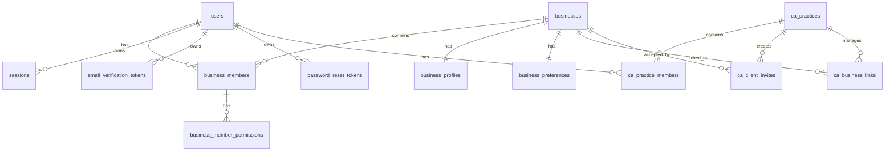

# GSTFY Implementation Status

Last updated: 2026-08-17

This document describes what is currently implemented in the GSTFY codebase across the web frontend and custom backend. It is based on the current repository state, not the older Supabase/NestJS plan.

## 1. Current High-Level Architecture

GSTFY is currently a monorepo with a custom backend, a Next.js web app, shared core feature flags, and a started mobile app.

```text
gstfy/
+-- apps/
|   +-- backend/      # Custom Fastify API server, PostgreSQL, Drizzle ORM
|   +-- web/          # Next.js app for business and CA dashboards
|   +-- mobile/       # Expo app started separately; not covered in detail here
+-- packages/
|   +-- core/         # Shared plan/module feature flags
+-- docs/
    +-- implementation-status.md
```

The active backend is `apps/backend`, not the older `apps/api` Supabase/Nest backend.

## 2. Runtime Stack

### Backend

| Area | Current implementation |
|---|---|
| Runtime | Node.js with TypeScript ESM |
| HTTP framework | Fastify 5 |
| Database | PostgreSQL |
| ORM | Drizzle ORM |
| SQL driver | `postgres` |
| Validation | Zod |
| Password hashing | Argon2id |
| Access tokens | JWT via `jose` |
| Refresh sessions | HTTP-only refresh cookie + DB-backed session table |
| Email | Nodemailer SMTP |
| Phone OTP | Firebase Auth ID token verification on backend; Firebase client on frontend |
| Avatar | Dicebear glyphs, stored as seed/style, rendered as SVG route |
| Migrations | SQL files in `apps/backend/drizzle`, auto-run with advisory lock |

### Web Frontend

| Area | Current implementation |
|---|---|
| Framework | Next.js App Router |
| React | React 19 |
| Data fetching | TanStack Query |
| Styling | Tailwind CSS |
| UI primitives | Local shadcn/Base UI style components under `apps/web/components/ui` |
| Forms/validation | Local state + Zod in key auth flows |
| Tables | TanStack Table installed; some screens use shadcn table components |
| Charts | Recharts |
| I18n | i18next with English, Hindi, Tamil |
| Auth state | `sessionStorage` for access token/session metadata, HTTP-only backend refresh cookie |

## 3. Domains and Subdomain Model

The app now supports a tenant-aware subdomain model.

| Host type | Purpose |
|---|---|
| `auth.gstfy.in` / `auth.localhost:3000` | Common auth surface for business and CA login/register |
| `<tenant>.gstfy.in` / `<tenant>.localhost:3000` | Business workspace dashboard |
| `ca.gstfy.in` / `ca.localhost:3000` | CA dashboard |
| `api.gstfy.in` / `api.localhost:4000` | Backend API |

Backend tenant resolution happens from:

1. Request origin host.
2. Request referer host.
3. Request host.
4. `X-GSTFY-Tenant` header in development only, with origin/header mismatch protection.

Reserved subdomains are blocked for tenant slugs:

```text
api, app, auth, ca, admin, www, mail, support, gstfy
```

## 4. API Versioning

All application API routes are mounted under:

```text
/api/v1
```

Health checks are intentionally unversioned:

```text
GET /health
GET /health/db
GET /health/migrations
```

The web API client builds requests as:

```text
NEXT_PUBLIC_API_URL + /api/v1 + route
```

Default web API URL:

```text
http://api.localhost:4000
```

## 5. Backend Modules

### 5.1 App Bootstrap

File: `apps/backend/src/app.ts`

Implemented:

- Fastify app creation.
- Request/response/error logging.
- CORS with subdomain-aware origin allowlist.
- Cookie support.
- Central error handler.
- Health endpoints.
- Versioned backend route registration under `/api/v1`.

Registered route modules:

```text
avatar
auth
ca
account
settings
users
```

### 5.2 Environment Config

File: `apps/backend/src/config/env.ts`

Important environment variables:

| Variable | Purpose |
|---|---|
| `PORT` | API port, default `4000` |
| `HOST` | Bind host, default `0.0.0.0` |
| `DATABASE_URL` | PostgreSQL connection string |
| `WEB_ORIGIN` | Main web origin, used for email links |
| `APP_BASE_DOMAIN` | Base domain used for tenant/CA/auth URLs |
| `COOKIE_DOMAIN` | Optional cookie domain for cross-subdomain refresh cookie |
| `COOKIE_SECURE` | Secure cookie flag |
| `COOKIE_SAME_SITE` | `lax`, `strict`, or `none` |
| `JWT_ACCESS_SECRET` | JWT signing secret, minimum 32 chars |
| `JWT_ACCESS_TTL_SECONDS` | Access token TTL, default `900` |
| `REFRESH_TOKEN_TTL_DAYS` | Refresh session TTL, default `30` |
| `SMTP_HOST`, `SMTP_PORT`, `SMTP_SECURE`, `SMTP_USER`, `SMTP_PASS`, `SMTP_AUTH_METHOD`, `MAIL_FROM` | Email delivery |
| `AUTO_RUN_MIGRATIONS` | Auto-run migrations on backend start |
| `FIREBASE_PROJECT_ID`, `FIREBASE_CLIENT_EMAIL`, `FIREBASE_PRIVATE_KEY`, `GOOGLE_APPLICATION_CREDENTIALS` | Firebase Admin credentials |

Boolean environment parsing was fixed so string `"false"` is treated as false, not truthy.

### 5.3 Database and Migrations

Files:

```text
apps/backend/src/db/client.ts
apps/backend/src/db/migrations.ts
apps/backend/drizzle/*.sql
```

Implemented:

- Auto migration runner.
- Migration ledger table `public.gstfy_migrations`.
- SHA-256 checksum tracking.
- PostgreSQL advisory lock to prevent concurrent migration runs.
- `/health/migrations` endpoint returns ledger and pending status.

Current migration files:

| Migration | Purpose |
|---|---|
| `0000_custom_core.sql` | Core auth/business/CA/session tables |
| `0001_settings_users.sql` | Settings and user permission related tables |
| `0002_settings_response_alignment.sql` | Settings response alignment changes |
| `0003_user_profile_images.sql` | Adds profile image fields |
| `0004_profile_image_seed_only.sql` | Stores avatar seed/style instead of SVG payload |
| `0005_ca_clients.sql` | CA client invites and CA-business links |
| `0006_remove_default_gst_slab.sql` | Removes default GST slab concept from settings flow |
| `0007_business_tenant_slug_backfill.sql` | Tenant slug backfill/support |

## 6. Database Schema

Source: `apps/backend/src/db/schema/index.ts`

### 6.1 Entity Relationship Overview



### 6.2 `users`

Stores all auth users: business owners, staff users, and CA users.

| Column | Type | Notes |
|---|---|---|
| `id` | uuid | Primary key |
| `email` | text | Unique nullable |
| `phone_e164` | text | Unique nullable |
| `password_hash` | text | Argon2id hash |
| `full_name` | text | Display name |
| `profile_image_seed` | text | Dicebear avatar seed |
| `profile_image_style` | text | Defaults to `glyphs` |
| `locale` | text | Defaults to `en` |
| `status` | text | Defaults to `active` |
| `email_verified_at` | timestamptz | Email verification marker |
| `phone_verified_at` | timestamptz | Phone verification marker |
| `last_login_at` | timestamptz | Last successful login time |
| `created_at`, `updated_at` | timestamptz | Audit timestamps |

Indexes:

- `users_email_unique`
- `users_phone_e164_unique`

### 6.3 `businesses`

Tenant-level business workspace.

| Column | Type | Notes |
|---|---|---|
| `id` | uuid | Primary key |
| `tenant_slug` | text | Unique workspace slug |
| `legal_name` | text | Legal business name |
| `trade_name` | text | Trade/display name |
| `pan` | text | Business PAN |
| `constitution` | text | Proprietorship, private limited, etc. |
| `status` | text | Defaults to `pending_verification` |
| `created_by` | uuid | References `users.id`, nullable on user delete |
| `created_at`, `updated_at` | timestamptz | Audit timestamps |

Indexes:

- `businesses_tenant_slug_unique`
- `businesses_pan_idx`

### 6.4 `business_profiles`

Registration, GST, contact, and address details for a business.

| Column | Type | Notes |
|---|---|---|
| `business_id` | uuid | Primary key, references `businesses.id` |
| `gstin` | text | GSTIN |
| `business_email` | text | Optional business email |
| `business_mobile` | text | Optional business phone |
| `primary_contact_name` | text | Main contact |
| `primary_contact_email` | text | Main contact email |
| `primary_contact_mobile` | text | Main contact mobile |
| `taxpayer_type` | text | Example `regular` |
| `registration_date` | text | Effective registration date |
| `address_line_1` | text | Principal address line 1 |
| `address_line_2` | text | Principal address line 2 |
| `locality` | text | Locality |
| `district` | text | District |
| `pincode` | text | 6 digit pincode |
| `state_code` | text | GST state code |
| `possession_type` | text | Rented, leased, owned, etc. |
| `location_source` | text | `manual` or `browser_geolocation` |
| `created_at`, `updated_at` | timestamptz | Audit timestamps |

### 6.5 `business_preferences`

Invoice, GST preset, and printer settings.

| Column | Type | Notes |
|---|---|---|
| `business_id` | uuid | Primary key, references `businesses.id` |
| `invoice_template` | text | Stored as `classic`, `modern`, or `compact` |
| `invoice_prefix` | text | Default `INV` |
| `invoice_next_number` | integer | Default `1` |
| `enabled_gst_slabs` | text | Comma list, default `5,12,18,28` |
| `printer_paper_size` | text | `a4`, `a5`, `thermal_80mm` |
| `printer_copies` | integer | Default `1` |
| `print_orientation` | text | `portrait` or `landscape` |
| `auto_open_print_dialog` | boolean | Default true |
| `compact_print_layout` | boolean | Default false |
| `created_at`, `updated_at` | timestamptz | Audit timestamps |

Note: There is no default GST slab anymore. The remaining GST setting is an enabled slab list.

### 6.6 `business_members`

Links users to businesses.

| Column | Type | Notes |
|---|---|---|
| `id` | uuid | Primary key |
| `business_id` | uuid | References `businesses.id` |
| `user_id` | uuid | References `users.id` |
| `role` | text | `owner`, `admin`, `staff`, `accountant`, `cashier` |
| `status` | text | `active`, `invited`, `disabled` |
| `created_at`, `updated_at` | timestamptz | Audit timestamps |

Unique:

- `business_members_business_user_unique`

### 6.7 `business_member_permissions`

Per-member module permissions.

| Column | Type | Notes |
|---|---|---|
| `id` | uuid | Primary key |
| `business_member_id` | uuid | References `business_members.id` |
| `module` | text | Module key |
| `can_view` | boolean | View access |
| `can_create` | boolean | Create access |
| `can_edit` | boolean | Edit access |
| `can_delete` | boolean | Delete access |
| `created_at`, `updated_at` | timestamptz | Audit timestamps |

Unique:

- `business_member_permissions_member_module_unique`

### 6.8 `ca_practices`

CA workspace root entity.

| Column | Type | Notes |
|---|---|---|
| `id` | uuid | Primary key |
| `owner_user_id` | uuid | References `users.id` |
| `practice_name` | text | CA firm/practice name |
| `status` | text | Default `active` |
| `contact_email` | text | Optional |
| `contact_phone_e164` | text | Optional |
| `created_at`, `updated_at` | timestamptz | Audit timestamps |

Unique:

- `ca_practices_owner_user_unique`

### 6.9 `ca_practice_members`

Links users to CA practice.

| Column | Type | Notes |
|---|---|---|
| `id` | uuid | Primary key |
| `practice_id` | uuid | References `ca_practices.id` |
| `user_id` | uuid | References `users.id` |
| `role` | text | Currently owner/admin style |
| `status` | text | Default `active` |
| `created_at`, `updated_at` | timestamptz | Audit timestamps |

Unique:

- `ca_practice_members_practice_user_unique`

### 6.10 `ca_client_invites`

CA-created referral codes/invites for client onboarding.

| Column | Type | Notes |
|---|---|---|
| `id` | uuid | Primary key |
| `practice_id` | uuid | References `ca_practices.id` |
| `client_name` | text | Client business name entered by CA |
| `client_email` | text | Optional invite recipient |
| `client_gstin` | text | Optional GSTIN lock |
| `referral_code` | text | Unique code, e.g. `GSTFY-XXXXXXXX` |
| `status` | text | `pending`, `accepted`, `revoked` |
| `expires_at` | timestamptz | Invite expiry, currently 30 days |
| `accepted_business_id` | uuid | References accepted business |
| `accepted_at` | timestamptz | Acceptance time |
| `created_at`, `updated_at` | timestamptz | Audit timestamps |

Indexes:

- `ca_client_invites_practice_id_idx`
- `ca_client_invites_referral_code_unique`

### 6.11 `ca_business_links`

Accepted CA to business link.

| Column | Type | Notes |
|---|---|---|
| `id` | uuid | Primary key |
| `practice_id` | uuid | References `ca_practices.id` |
| `business_id` | uuid | References `businesses.id` |
| `access_scope` | text | Default `gst_read_write` |
| `status` | text | Default `active` |
| `accepted_at` | timestamptz | Acceptance time |
| `created_at`, `updated_at` | timestamptz | Audit timestamps |

Indexes:

- `ca_business_links_practice_business_unique`
- `ca_business_links_practice_id_idx`
- `ca_business_links_business_id_idx`

### 6.12 `sessions`

Refresh session store.

| Column | Type | Notes |
|---|---|---|
| `id` | uuid | Primary key |
| `user_id` | uuid | References `users.id` |
| `refresh_token_hash` | text | SHA-256 hash of refresh token |
| `user_agent` | text | For account activity |
| `ip_address` | text | Stored but not displayed in account UI |
| `expires_at` | timestamptz | Refresh expiry |
| `revoked_at` | timestamptz | Logout/revocation marker |
| `created_at`, `updated_at` | timestamptz | Audit timestamps |

Indexes:

- `sessions_refresh_token_hash_unique`
- `sessions_user_id_idx`

### 6.13 `email_verification_tokens`

Email verification links.

| Column | Type | Notes |
|---|---|---|
| `id` | uuid | Primary key |
| `user_id` | uuid | References `users.id` |
| `token_hash` | text | SHA-256 URL token hash |
| `email` | text | Email being verified |
| `expires_at` | timestamptz | Expiry |
| `consumed_at` | timestamptz | One-time-use marker |
| `created_at`, `updated_at` | timestamptz | Audit timestamps |

Unique:

- `email_verification_tokens_hash_unique`

### 6.14 `password_reset_tokens`

Password reset links.

| Column | Type | Notes |
|---|---|---|
| `id` | uuid | Primary key |
| `user_id` | uuid | References `users.id` |
| `token_hash` | text | SHA-256 URL token hash |
| `expires_at` | timestamptz | Currently 1 hour |
| `consumed_at` | timestamptz | One-time-use marker |
| `created_at`, `updated_at` | timestamptz | Audit timestamps |

Unique:

- `password_reset_tokens_hash_unique`

### 6.15 `gstfy_migrations`

Migration ledger created by the custom migration runner.

| Column | Type | Notes |
|---|---|---|
| `name` | text | Primary key, migration filename |
| `checksum` | text | SHA-256 checksum |
| `applied_at` | timestamptz | Apply time |

## 7. Backend API Surface

All routes below are under `/api/v1` unless noted.

### 7.1 Health

| Method | Path | Auth | Purpose |
|---|---|---|---|
| GET | `/health` | No | API health |
| GET | `/health/db` | No | DB reachability |
| GET | `/health/migrations` | No | Migration ledger/status |

### 7.2 Auth

| Method | Path | Purpose |
|---|---|---|
| POST | `/auth/register` | Main business workspace registration with company, GST registration, account, mandatory CA referral |
| POST | `/auth/business/register` | Older/simpler business register path |
| POST | `/auth/lookup` | Lookup business account by email/phone and return tenant URL |
| POST | `/auth/ca-referral/verify` | Verify pending CA referral code, optionally against GSTIN |
| POST | `/auth/login` | Business login with email or phone identifier |
| POST | `/auth/business/login` | Older email-only business login |
| POST | `/auth/ca/register` | CA account and CA practice registration |
| POST | `/auth/ca/login` | CA login |
| POST | `/auth/phone/verify` | Verify Firebase phone token and create auth session |
| GET | `/auth/me` | Current user profile and business memberships |
| GET | `/auth/session` | Refresh access token from HTTP-only refresh cookie |
| POST | `/auth/logout` | Revoke refresh session and clear cookie |
| POST | `/auth/password/forgot` | Send password reset email |
| POST | `/auth/password/reset` | Consume reset token and update password |
| POST | `/auth/email/verify` | Consume email verification token |

Key auth behavior:

- Access token is short-lived JWT.
- Refresh token is sent only as HTTP-only cookie `gstfy_refresh`.
- Refresh token hash is stored in `sessions`.
- Web stores only access token/session metadata in `sessionStorage`.
- Login redirects are generated based on account type:
  - Business -> `<tenant-domain>/dashboard`
  - CA -> `ca.<base-domain>/dashboard`

### 7.3 Account

| Method | Path | Purpose |
|---|---|---|
| GET | `/account` | Account profile alias response |
| PATCH | `/account` | Update full name and locale |
| GET | `/account/settings` | Account settings and last two sessions |
| PATCH | `/account/settings/user` | Update account display name/locale |
| POST | `/account/settings/user/phone/verify` | Verify and save phone number with Firebase ID token |
| POST | `/account/settings/user/password` | Change password |
| POST | `/account/settings/user/avatar` | Generate/change Dicebear avatar seed |

### 7.4 Business Settings

| Method | Path | Purpose |
|---|---|---|
| GET | `/settings` | Full business settings payload |
| PATCH | `/settings/business` | Editable business/profile fields |
| POST | `/settings/business/ca-referral` | Link an existing business to a CA referral code |
| PATCH | `/settings/business/tenant` | Set workspace URL/tenant slug when missing |
| PATCH | `/settings/user` | Update business-context user profile |
| POST | `/settings/user/phone/verify` | Verify business-context user phone |
| POST | `/settings/user/password` | Change password |
| POST | `/settings/user/avatar` | Generate/change avatar seed |
| PATCH | `/settings/invoice` | Invoice template and prefix |
| PATCH | `/settings/gst-rates` | Enabled GST slab list |
| PATCH | `/settings/gst-presets` | Alias for enabled GST slab list |
| PATCH | `/settings/printer` | Printer preferences |

Protected behavior:

- Requires active business membership.
- Business edit routes require owner/admin via `assertCanManageBusiness`.
- Registration date can be set only if it is missing.
- Tenant slug cannot be changed once set.
- Tenant slug uniqueness is checked.
- CA referral cannot be linked twice.

### 7.5 CA Clients and Referrals

| Method | Path | Purpose |
|---|---|---|
| GET | `/ca/clients` | CA dashboard data: practice, active clients, invites |
| POST | `/ca/clients` | Create client invite/referral code and send email if email exists |
| POST | `/ca/invites/accept` | Existing registered business accepts invite |
| GET | `/ca/clients/:businessId/summary` | CA view of one linked client summary |
| POST | `/ca/clients/:businessId/revoke` | Revoke CA-client link |

CA invite behavior:

- Referral code format is generated as `GSTFY-XXXXXXXX`.
- Invite expires after 30 days.
- Invite email is sent through Nodemailer if client email is provided.
- Current email CTA links to `/auth/register?referralCode=...`.
- Business registration pre-fills and auto-verifies the referral code on the account step.
- If `clientGstin` was provided, acceptance/register validation enforces matching GSTIN.

### 7.6 Users and Roles

Backend routes:

| Method | Path | Purpose |
|---|---|---|
| GET | `/users` | List business users |
| POST | `/users` | Add or link a user to the business |
| PATCH | `/users/:memberId` | Update member details, role, status, permissions |
| DELETE | `/users/:memberId` | Soft-disable member |

Implemented backend behavior:

- Owner/admin required for mutation.
- Existing users are linked if email already exists.
- New users get a Dicebear avatar seed.
- Permissions are replaced per update.
- Owner permissions cannot be edited.
- Owner access cannot be removed.

Current frontend/backend gap:

- `apps/web/lib/users/api.ts` expects richer metadata: `meta`, `presets`, `branches`, and normalized user shape.
- Current backend `users.routes.ts` returns a simpler `{ users }` list and `{ user }` mutation response.
- This should be aligned before continuing serious users-module work.

### 7.7 Avatar

| Method | Path | Purpose |
|---|---|---|
| GET | `/avatars/profile/:seed.svg` | Render Dicebear glyph avatar SVG from stored seed |

Avatars are no longer stored as full SVG in the database. Only seed/style are stored.

## 8. Main Backend Flows

### 8.1 CA Registration

```text
POST /api/v1/auth/ca/register
  -> validate full name, practice name, email, password
  -> create user with password hash and avatar seed
  -> create ca_practices row
  -> create ca_practice_members owner row
  -> create refresh session
  -> set refresh cookie
  -> return access token and redirectTo ca.<domain>/dashboard
```

### 8.2 CA Login

```text
POST /api/v1/auth/ca/login
  -> verify email/password
  -> ensure active ca_practice_members row
  -> update last_login_at
  -> create refresh session
  -> set refresh cookie
  -> return access token and redirectTo ca.<domain>/dashboard
```

### 8.3 CA Invites Business Client

```text
POST /api/v1/ca/clients
  -> require CA practice access
  -> validate clientName/clientEmail/clientGstin
  -> generate unique referral code
  -> insert ca_client_invites(status=pending, expires_at=now+30 days)
  -> build /auth/register?referralCode=...
  -> send email if clientEmail exists
  -> return updated CA dashboard response plus createdInvite
```

### 8.4 Business Registration by CA Referral

```text
GET /auth/register?referralCode=GSTFY-XXXXXXXX
  -> web pre-fills CA referral code
  -> user enters company data
  -> user enters GST registration/profile data
  -> account step auto-verifies referral code once GSTIN is available
  -> code locks after successful verification
  -> submit POST /api/v1/auth/register
```

Backend transaction:

```text
POST /api/v1/auth/register
  -> create users row
  -> create unique tenant_slug from tradeName
  -> create businesses row
  -> create business_members owner row
  -> create business_profiles row
  -> find pending, unexpired ca_client_invites by referralCode
  -> if invite.client_gstin exists, compare with registration.gstin
  -> create/upsert ca_business_links row
  -> mark invite accepted
  -> send email verification if email registration
  -> return session=null, tenant, redirectTo tenant auth login, business, registration
```

The register response intentionally returns `session: null`; the user must verify email or phone before login.

### 8.5 Business Login

```text
POST /api/v1/auth/lookup
  -> lookup account by email or Indian phone
  -> find active business membership, optionally scoped by tenant slug
  -> return displayName, GSTIN, tenantSlug, tenantUrl

POST /api/v1/auth/login
  -> verify email/password or phone/password depending identifier
  -> find tenant-scoped active business
  -> update last_login_at
  -> create refresh session
  -> set refresh cookie
  -> return access token, tenant, redirectTo tenant dashboard
```

The login page uses lookup to show workspace switch UI when an account belongs to a tenant.

### 8.6 Session Refresh

```text
GET /api/v1/auth/session
  -> read gstfy_refresh cookie
  -> hash token and find non-revoked, unexpired sessions row
  -> load active user
  -> issue fresh access token
  -> return user, accessToken, accessTokenExpiresIn, tenant
```

The web shell schedules token refresh before access token expiry. If refresh fails, the user is redirected to the correct login surface.

### 8.7 Forgot and Reset Password

```text
POST /api/v1/auth/password/forgot
  -> if user exists, create password_reset_tokens row
  -> send reset email
  -> always returns success

POST /api/v1/auth/password/reset
  -> validate token hash
  -> ensure not consumed and not expired
  -> update password hash
  -> mark token consumed
```

### 8.8 Existing Business Links CA Referral Later

```text
POST /api/v1/settings/business/ca-referral
  -> require owner/admin
  -> ensure no active CA link already exists
  -> verify pending, unexpired referral code
  -> compare GSTIN if invite has clientGstin
  -> create ca_business_links
  -> mark invite accepted
```

## 9. Frontend Structure

### 9.1 Auth Routes

| Route | Component/flow |
|---|---|
| `/auth/login` | Business login |
| `/auth/register` | Business registration wizard |
| `/auth/forgot-password` | Forgot password |
| `/auth/reset-password` | Reset password |
| `/auth/ca/login` | CA login |
| `/auth/ca/register` | CA registration |
| `/ca/accept` | Existing business accepts CA invite manually |

Business register wizard:

1. Company step:
   - Legal name
   - Trade name
   - PAN
   - Constitution
   - Optional business email/mobile
   - Primary contact
2. GST registration step:
   - GSTIN
   - Taxpayer type
   - Effective registration date with shadcn calendar
   - Principal address
   - Locality/district/pincode/state
   - Nature of possession
   - Browser geolocation can auto-fill district/pincode/state
3. Account step:
   - Workspace URL preview
   - CA referral code with verify button
   - Invite query code prefill and auto-verify
   - Email/phone identifier
   - Password and confirm password
   - Terms notice

Auth UI details implemented:

- India flag phone input pattern.
- Firebase phone OTP flow on web.
- Shadcn `InputOTP` used in login OTP flow.
- Spinner component used instead of text like `Signing in...` and `Verifying...`.
- Auth pages include terms/privacy notice.
- Business and CA auth are separated.
- Authenticated users are blocked from auth pages and redirected based on account type.

### 9.2 Dashboard Routes

| Route | Purpose |
|---|---|
| `/dashboard` | Business dashboard home or CA dashboard on CA subdomain |
| `/account` | Account settings |
| `/settings` | Business settings |
| `/users` | Business users/permissions |
| `/purchases` | Purchase list |
| `/purchases/add` | Purchase create |
| `/purchases/view/[id]` | Purchase view |
| `/purchases/edit/[id]` | Purchase edit |
| `/branches/new` | Add branch wizard without dashboard chrome |
| `/dashboard/clients` | CA clients list on CA dashboard naming path |
| `/dashboard/clients/[businessId]` | CA client summary |
| `/dashboard/referral-codes` | CA referral codes |
| `/ca` | Legacy CA dashboard route |
| `/ca/clients` | Legacy CA clients route |
| `/ca/clients/[businessId]` | Legacy CA client summary route |
| `/ca/referral-codes` | Legacy CA referral codes route |

### 9.3 Dashboard Shell

Files:

```text
apps/web/components/dashboard/dashboard-shell.tsx
apps/web/components/dashboard/dashboard-topbar.tsx
apps/web/components/app-sidebar.tsx
apps/web/components/nav-user.tsx
```

Implemented:

- Session bootstrap from refresh cookie if session storage is empty.
- Auto-refresh access token before expiry.
- Account type enforcement:
  - CA users are pushed to CA dashboard.
  - Business users are prevented from CA dashboard.
- Sidebar with module categories.
- Collapsed sidebar state persisted in localStorage.
- Separate CA/business navigation behavior.
- Topbar with:
  - Sidebar trigger
  - Command search
  - Notification icon
  - GST state emblem based on active GSTIN
  - Theme toggle
  - Language switcher hidden on mobile

### 9.4 Business Dashboard

Files:

```text
apps/web/components/dashboard/overview-dashboard.tsx
apps/web/lib/dashboard/mock-overview.ts
```

Implemented UI:

- Overview hero card.
- Metrics for total sales, purchase, income, expenses, customers, suppliers, sales returns, purchase returns.
- Revenue statistic chart.
- Reports pie chart.
- Low stock table.
- Recent sales/recent purchases table with tabs.
- Recent activity style cards.

Current data source:

- Mock/static frontend data.
- No backend dashboard aggregation API yet.

### 9.5 Settings Page

Files:

```text
apps/web/components/settings/settings-page.tsx
apps/web/lib/settings/api.ts
```

Implemented sections:

- Business details.
- Registration details split into editable/non-editable concepts.
- CA referral state and add/verify behavior.
- Workspace URL generation for old users missing tenant slug.
- Invoice settings:
  - Template preview selection, no dropdown.
  - Invoice prefix.
- GST rate presets:
  - Enabled slab list only.
  - No default GST slab.
- Printer settings:
  - Paper size.
  - Orientation.
  - Auto open print dialog.
  - Compact print layout.

### 9.6 Account Page

Files:

```text
apps/web/components/account/account-page.tsx
apps/web/lib/account/api.ts
```

Implemented:

- Account settings page for business users.
- Similar account page flow for CA context.
- Display name and preferred language.
- Preferred language uses label/flag-style language display.
- Phone field is removed for CA account page.
- Business account phone verification uses Firebase OTP UI flow.
- Avatar generate/change:
  - Uses Dicebear glyph seed.
  - Shows generate when missing.
  - Shows change when existing.
- Change password section with clear action.
- Security activity section:
  - Shows last two sessions.
  - Does not expose IP address in UI.
- Knowledge-base style helper panel explaining email/phone login behavior.

### 9.7 CA Dashboard

Files:

```text
apps/web/components/ca/ca-dashboard-page.tsx
apps/web/components/ca/ca-clients-page.tsx
apps/web/components/ca/ca-referral-codes-page.tsx
apps/web/components/ca/ca-client-summary-page.tsx
apps/web/lib/ca/api.ts
```

Implemented:

- CA dashboard route on `ca.<domain>/dashboard`.
- CA clients list.
- Referral codes list.
- Add client/invite flow.
- Email invite delivery status toast.
- Copy referral code and invite link.
- Open linked client summary.
- Revoke linked client.
- Client summary page has placeholder filing snapshot data.

### 9.8 Parties Section

Files:

```text
apps/web/components/parties/parties-page.tsx
apps/web/lib/parties/api.ts
apps/backend/src/modules/parties/parties.routes.ts
apps/backend/src/modules/parties/parties.schemas.ts
apps/backend/src/modules/payment-terms/payment-terms.routes.ts
apps/backend/drizzle/0025_party_master_hardening.sql
apps/backend/drizzle/0026_pos_party_snapshot_payment_terms.sql
apps/backend/drizzle/0027_party_payment_term_fk.sql
apps/backend/drizzle/0028_party_master_integrity_constraints.sql
apps/backend/drizzle/0029_party_delete_restrict.sql
```

Implemented:

- Tenant-scoped party master for customers and suppliers.
- A party can be customer, supplier, or both.
- Compact table with search, role/status filters, sortable headers, bulk actions, and scroll containment.
- Add/edit/view/archive flows use dialog UI.
- Individual parties avoid unnecessary business identity fields.
- GST registration, primary address, and primary contact are optional.
- Clearing GST/address/contact during edit archives the existing child record.
- Removing customer/supplier role access marks the role profile inactive instead of deleting it.
- Database hardening enforces one active primary GST/address/contact/bank record per party.
- Party detail includes multi-GSTIN add/edit/archive/set-primary management.
- Party detail renders receivable/payable outstanding from accounting entries.
- Duplicate warnings are shown for matching name, PAN, primary GSTIN, phone, and email.
- POS sales now persist their own `party_snapshot` in addition to the accounting voucher snapshot.
- Payment terms master foundation is available at `/api/v1/payment-terms`.
- Customer/supplier profiles now reference payment terms through `default_payment_term_id`.
- Party child tables now have database-level composite tenant integrity constraints for `(party_id, business_id)`.
- Party default references are database-hardened against cross-party/cross-business GST, address, payment-term, warehouse, branch, and ledger-account mismatches.
- Party GST effective dates are stored as `date`, and party accounting account references are UUID FKs to business-owned ledger accounts.
- Party child records now restrict hard deletion of parties; the supported delete behavior remains soft archive.
- Party avatars use Dicebear profile image seeds.
- Archive is soft and transaction-safe for sales/POS/purchase usage.

Detailed frontend/backend flow:

```text
docs/parties-section-flow.md
```

### 9.9 Users Section

Files:

```text
apps/web/components/users/users-page.tsx
apps/web/lib/users/api.ts
apps/web/lib/users/presets.ts
apps/web/lib/dashboard/modules.ts
```

Implemented frontend intent:

- User list.
- Add/edit/delete user drawer/dialog.
- Permission presets:
  - Cashier
  - Manager
  - Accountant
  - Operations
  - Custom
- Module permissions include view/create/edit/delete.
- Owner cannot edit own permissions.
- Delete uses shadcn dialog.

Important current gap:

- Frontend users API expects branch/preset metadata not returned by backend yet.

### 9.10 Purchases

Files:

```text
apps/web/components/purchases/*
apps/web/lib/purchases/*
```

Implemented frontend UI:

- Purchase list.
- Add/edit/view pages.
- Action dialogs/options such as view, edit, print, PDF, send email, delete.

Current data source:

- Mock frontend data.
- No PostgreSQL purchase tables or backend purchase APIs yet.

### 9.11 Branch Wizard

Files:

```text
apps/web/app/branches/new/page.tsx
apps/web/components/branches/add-branch-page.tsx
```

Implemented:

- Separate branch creation page without dashboard sidebar/topbar.
- Step-style UI based on the register wizard direction.
- Includes storage/warehouse management concept.

Current gap:

- No backend branch table/API exists yet.
- Users module references branches conceptually, but backend schema does not yet model branches.

### 9.12 I18n

Files:

```text
apps/web/messages/en.json
apps/web/messages/hi.json
apps/web/messages/ta.json
apps/web/lib/i18n/*
```

Implemented:

- English, Hindi, Tamil resources.
- Auth/register translation coverage.
- Language dropdown uses localized language labels.
- Header language switch hidden on mobile dashboard.

## 10. Shared Feature Flags and Sidebar Modules

File: `packages/core/src/lib/featureFlags.ts`

Plans:

```text
micro
small
pro
ca
```

Module access map:

| Module | Plans |
|---|---|
| overview | micro, small, pro, ca |
| invoices | micro, small, pro, ca |
| expenses | micro, small, pro, ca |
| gstr | micro, small, pro, ca |
| aireview | micro, small, pro, ca |
| parties | micro, small, pro, ca |
| integrations | micro, small, pro, ca |
| einvoice | small, pro, ca |
| ewaybill | small, pro, ca |
| purchases | small, pro, ca |
| inventory | small, pro, ca |
| reports | small, pro, ca |
| pos | pro, ca |
| multigstin | pro, ca |

Current business sidebar intentionally hides some planned modules:

- AI Review removed.
- E-Invoice removed.
- E-Way Bill removed.
- Integrations removed.
- CA workspace removed from business sidebar.

Current frontend default plan is `small`.

## 11. Security and Access Control Implemented

### Auth security

- Passwords hashed with Argon2id.
- JWT access tokens are short lived.
- Refresh tokens are random URL-safe tokens.
- Refresh tokens are stored only as SHA-256 hashes.
- Refresh token is stored in HTTP-only cookie.
- Logout revokes session by setting `revoked_at`.
- Password reset and email verification tokens are one-time-use and hashed in DB.

### Tenant security

- Tenant is resolved from trusted host/origin/referer first.
- Tenant header fallback is development-only.
- If tenant header and request origin disagree, backend throws an error.
- Reserved tenant slugs are blocked.
- Tenant slug is immutable after being set.
- Business access queries are tenant-scoped when tenant is available.

### Business permission security

- Owner/admin required for management routes.
- Owner permissions cannot be edited.
- Owner access cannot be removed.
- User permission rows are unique per business member/module.

### CA referral security

- Referral codes are unique.
- Referral codes expire.
- Only `pending` referrals can be accepted.
- If invite includes GSTIN, the registering/linking business GSTIN must match.
- A business cannot link more than one active CA referral.

### CORS

- Backend allows configured `WEB_ORIGIN`.
- Backend allows subdomains of `APP_BASE_DOMAIN`.
- Credentials are enabled.
- Allowed headers include `Authorization`, `Content-Type`, and `X-GSTFY-Tenant`.

## 12. Email and OTP

### Email

Nodemailer is configured in backend.

Implemented email types:

- Email verification.
- Password reset.
- CA client invite/referral.

Current local provider used during development:

- Mailtrap SMTP.

### Phone OTP

Frontend:

- Uses Firebase client SDK to send/confirm OTP.

Backend:

- Accepts Firebase ID token.
- Verifies ID token with Firebase Admin.
- Extracts verified phone number.
- Saves phone as E.164.

Business account phone login is supported. CA phone login is intentionally not supported in the account page.

## 13. Important Request/Response Shapes

### Business Register Payload

```ts
{
  identifier: string
  password: string
  caReferralCode: string
  company: {
    legalName: string
    tradeName: string
    pan: string
    constitution: string
    businessEmail?: string
    businessMobile?: string
    primaryContactName: string
    primaryContactMobile: string
    primaryContactEmail: string
  }
  registration: {
    gstin: string
    taxpayerType: string
    registrationDate: string
    principalAddressLine1: string
    principalAddressLine2?: string
    locality: string
    district: string
    pincode: string
    stateCode: string
    possessionType: string
    locationSource?: "manual" | "browser_geolocation"
  }
}
```

### Business Register Response

```ts
{
  user: {
    id: string
    email: string | null
    phone: string | null
    profileImageSeed?: string | null
    profileImageStyle?: "glyphs"
  }
  session: null
  tenant: {
    id: string
    slug: string
    legalName: string
    tradeName: string
    url: string
  }
  redirectTo: string
  requiresVerification: true
  onboardingStatus: "pending"
  business: object
  registration: object
}
```

### Login Response

```ts
{
  user: {
    id: string
    email: string | null
    phoneE164: string | null
    profileImageSeed: string | null
    profileImageStyle: "glyphs"
  }
  accessToken: string
  accessTokenExpiresIn: number
  redirectTo: string
  tenant: {
    id: string
    slug: string
    legalName: string
    tradeName: string
    url: string
  } | null
}
```

### Settings Response

```ts
{
  business: object
  registration: object
  user: object
  securityActivity: {
    lastLoginAt: string | null
    recentSessions: Session[]
  }
  caReferral: {
    referralCode: string | null
    practiceName: string | null
    status: "linked" | "not_linked"
    linkedAt: string | null
    canAdd: boolean
  }
  invoiceSettings: object
  gstRateSettings: object
  printerSettings: object
  permissions: {
    canEditBusiness: boolean
    role: string
  }
}
```

### CA Dashboard Response

```ts
{
  practice: {
    id: string
    name: string
    contactEmail: string | null
    contactPhone: string | null
    status: string
  }
  clients: Array<{
    id: string
    businessId: string
    businessName: string
    tradeName: string
    gstin: string | null
    accessScope: "gst_read_write"
    status: "active" | "revoked"
    acceptedAt: string
  }>
  invites: Array<{
    id: string
    clientName: string
    clientEmail: string | null
    clientGstin: string | null
    referralCode: string
    inviteUrl: string
    status: "pending" | "accepted" | "expired" | "revoked"
    expiresAt: string
    acceptedBusinessId: string | null
    acceptedAt: string | null
    createdAt: string
  }>
  createdInvite?: {
    referralCode: string
    inviteUrl: string
    emailDelivery: object
  }
}
```

## 14. Current Known Gaps

These are important before continuing feature development.

| Area | Gap |
|---|---|
| Users module | Frontend expects `meta`, `presets`, `branches`; backend returns simpler users shape. Needs contract alignment. |
| Branches | Frontend branch wizard exists, but no `branches` table/API exists yet. |
| Purchases | UI exists with mock data, no backend purchase schema/API. |
| Dashboard analytics | Overview dashboard uses mock data, no aggregation API. |
| CA client summary | Filing snapshot values are placeholders. |
| GSTIN validation | Manual format validation exists; no real GSTN API integration yet. |
| Invoice engine | Settings UI exists, but invoice generation/template rendering backend is not implemented. |
| GST filing | No GSTR JSON generation or filing API implemented yet. |
| Permissions enforcement | User permissions are stored, but most feature routes are not yet enforcing per-module permissions. |
| Mobile app | Expo app was started, but this document only covers active web/backend behavior. |

## 15. Recommended Next Build Order

1. Align Users API contract:
   - Add branch model or remove branch dependency temporarily.
   - Return `meta`, `presets`, `branches`, normalized users from backend.
2. Add branches backend:
   - `business_branches` table.
   - Primary branch seeded during business registration.
   - Add branch route wired to `/branches/new`.
3. Replace purchase mock data:
   - Purchase tables.
   - Supplier/party linkage.
   - Purchase CRUD endpoints.
4. Build invoice data model:
   - Parties.
   - Invoice headers.
   - Invoice line items.
   - Tax split calculations.
   - Sequential invoice number allocator.
5. Add real dashboard aggregation API.
6. Start GST summaries from stored invoice/purchase data.

## 16. Verification Commands

Backend typecheck:

```bash
pnpm --filter @gstfy/backend check-types
```

Web typecheck:

```bash
pnpm --filter web typecheck
```

Run backend:

```bash
pnpm --filter @gstfy/backend dev
```

Run web:

```bash
pnpm --filter web dev
```

Run all:

```bash
pnpm dev
```
